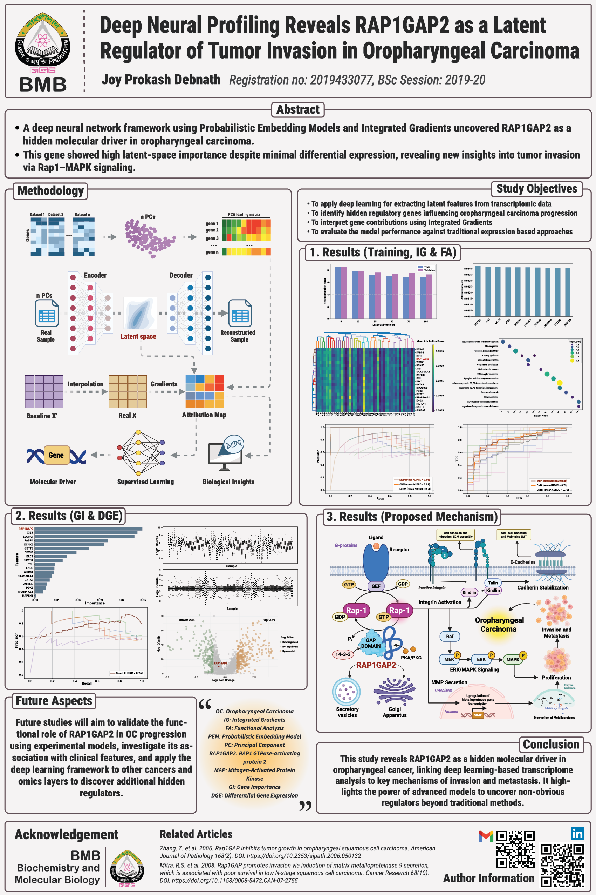

# Beyond Differential Expression: Deep Neural Profiling Reveals RAP1GAP2 as a Latent Regulator of Tumor Invasion in Oropharyngeal Carcinoma

This repository contains the code, analysis, and figures for my **4th-year undergraduate project (June–July 2025)** inspired by the **DeepProfile framework**.  
The project applies **deep learning (Variational Autoencoders, Integrated Gradients, ML benchmarking)** to transcriptomic data to uncover hidden drivers of oropharyngeal carcinoma.

---

## Abstract
**Background:** Conventional differential gene expression (DGE) analysis inadequately captures the complex molecular changes that drive the progression of oropharyngeal carcinoma (OC). **Variational Autoencoders (VAEs)** offer a deep learning approach to uncover hidden patterns in high-dimensional transcriptomic data.  

**Methods:** Gene expression datasets were combined from multiple databases and trained with a VAE to compress the data into a small hidden space. **Integrated Gradients**, an automated attribution technique, was used to determine the contribution of each gene to each latent node (biological representation). Genes that consistently had high attribution scores across all latent dimensions were chosen as potential regulators (driver genes). Pathway enrichment analysis and classification analyses unveiled the biological significance of these genes.  

**Results:** The VAE learned latent features that are biologically important, and Integrated Gradients highlighted a group of genes that strongly impact these features. **RAP1GAP2** was consistently one of the top contributors across all 50 latent variables. RAP1GAP2 had the highest latent-space importance and strong discriminative power for distinguishing OC, with a performance of **0.769 AUROC**. Notably, this occurred despite the lack of substantial differential expression in tumors relative to normal samples. Biological interpretation suggests that RAP1GAP2, a protein that activates Rap1 GTPase, may help tumors invade by turning off Rap1 and altering **MAPK signaling** and **Golgi-mediated secretion**.  

**Conclusion:** Our deep learning framework identified **RAP1GAP2** as a hidden driver in oropharyngeal carcinoma. This demonstrates how VAEs combined with Integrated Gradients can reveal molecular regulators overlooked by alternative approaches. The method provides new insights into OC biology that could guide future research and therapeutic strategies.  

**Keywords:** Oropharyngeal carcinoma; transcriptomics; deep learning; latent features; RAP1GAP2; Rap1 signaling; MAPK pathway; Golgi secretion  

---

## Poster

---

## Acknowledgements
- Inspired by **DeepProfile** (Nature Biomedical Engineering, 2024)  
- Supervision and guidance provided during my undergraduate thesis  

---

## License
Academic / non-commercial use only. Please cite if you use this work.
